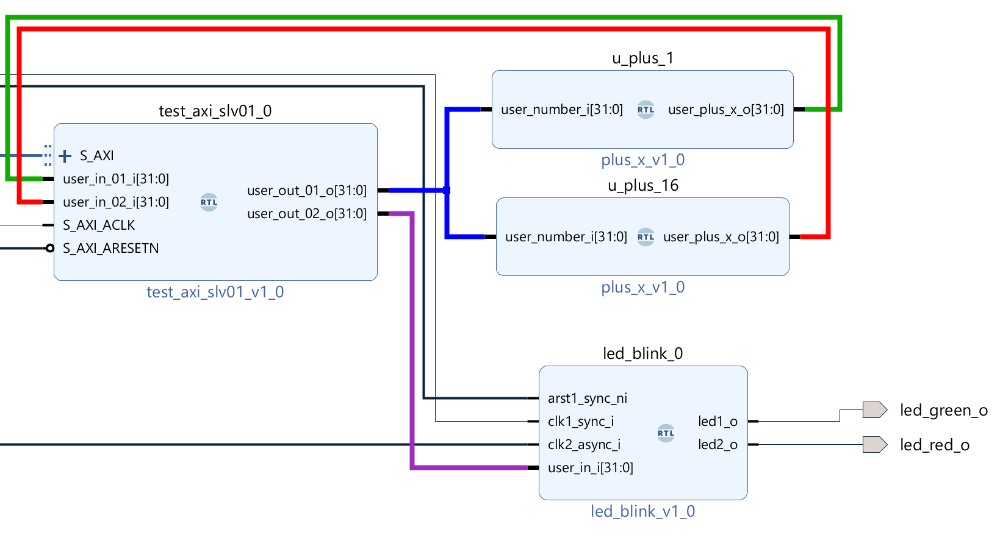

# CIAA-ACC_PS_PL_test01

This project implements a simple design that includes the PS and PL with  an AXI Interconnect and 2 slaves, as well as some external logic blocks.

**Important Note!** Make sure to install CIAA-ACC board files before opening the project. The board files are in the main Support file in the project, but also included in aux_stuff for the demo. Copy the board files to ***< Vivado Install >/data/boards/board_files/***

If you don't do hat you need to select "xc7z030fbg676-2" for the part number

## PS Software

You will need SW running on the PS to access the peripheral slaves. Refer to the  Linux directory to set up Linux on and SD and boot the PS on the FPGA in the  CIAA-ACC.

PL Design
-------
The design includes an AXI Interconnect with 2 slaves and some peripheral blocks. 

### Slave 00

**Base Address**:  0x43C00000  
**Input/Outputs**: None
**Description**: Xilinx template AXI slave with 4 read/write registers at addresses 0, 4, 8 and C.
 To test it write and read to/from addresses 43C00000 / 43C00004 / 43C00008 / 43C0000C  

### Slave 01 

**Base Address**: 0x43C10000
**Input/Outputs**: Two 32 bit inputs signals (user_in_01 and user_in02). Two 32-bit registered outputs (user_out_01 and user_out_02)
**Description**: Slave based on Xilinx AXI Slave template with 4 registers, modified to include some Input/Ouputs and an internal counter

**Register mapping**

| Address   | Read                    | Write                    |
| --------- | ----------------------- | ------------------------ |
| Base + 00 | ID + Version            | Counter Control          |
| Base + 04 | User Inputs 1 (32 bits) | User Outputs 1 (32 bits) |
| Base + 08 | User Inputs 2 (32 bits) | User Outputs 2 (32 bits) |
| Base + 0C | Internal Counter        | Ignored                  |

#### Internal counter

The internal counter counts at the clock frequency, and implements an 8-bit prescaler and 32 bit counter 

##### Counter Control Register

The Control register has the following bit-mappings

| Bits      |          |          |          |         |          |           |          |        |
| --------- | -------- | -------- | -------- | ------- | -------- | --------- | -------- | ------ |
| 31... 24  | 23...17  | 16       | 15..9    | 8       | 7..5     | 4         | 3...1    | 0      |
| Prescaler | Not used | One-Shot | Not used | Restart | Not Used | Up / Down | Not Used | Enable |

**Prescaler** (31..24): Pre-scaler counter maximum value for counter. Use x00 to count every clock cycle

**One-Shot**  (16): Counts to maximum (or minimum) value only once, then stops. 
**Restart**  (8) :  Restarts the counter (This write generates a reset pulse. It is not latched)
**Direction (Up/Down)**  (4) : 0=Count up. 1=Count down
**Enable** (0): 0=Disable counter. 1=Enable counter

 

### Slave 01 and External Block Connections

Slave 01 is connected to external blocks, and controls their operation through I/O. 

 

#### Read operations
**Read 43C10000**:  Read ID + Version (0x00010001)
**Read 43C10004**:  Read Ouput 1 + 0x01 (implemented by external adder and feedback) 
**Read 43C10008**:  Read Ouput 1 + 0x10 (implemented by external adder and feedback)
**Read 43C1000C**:  Read internal Slave 1 Counter

#### Write operations

**Write 43C10000**:  Write Slave 1 Counter Control Register (see description above)
**Write 43C10004**:  Write Slave 1 32-bit Ouput 1 that is mapped back to Inputs 1 and 2
**Write 43C10008**:  Control LED blink rate: Leds have a 1 ms time base.
                   Bits 31..16: Control red led @ 200 MHz (external clock) with 1 ms time base
                   Bits 15..0:  Control green led @ 100 MHz (FCLK1) with 1 ms time base
**Write 43C1000C**:  Ignored

### Led Blinker
The led blinker core is connected to the red and green leds. The input is 
  synchronous to the internal PS to PL FCLK1 clock, so there Clock Domain Crossing
  logic to control the led on the external 200 MHz clock.

Green Led is connected to the the internal FCLK1 clock which is configured for 
  100 MHz. The control logic includes a 1 ms time base generation and a 16 bit 
  blink rate divider controlled by input bits 15:0. 

Red led is connected to the the external 200 MHz clock on the CIAA-ACC board. 
  The control logic includes a 1 ms time base generation and a 16 bit blink rate 
  divider controlled by input bits 31:16. 

The 32-bit input is connected to Slave 1 Output 2 

### Adders
There are 2 blocks that add X to a 32-bit input, and output a 32 bit value. X is configured via a generic, and can only be changed at synthesis.

Slave 1 Output 1 is mapped to 2 of these blocks that add 1 and 16 respectively and map back to Slave 1 Inputs 1 and 2.

Clock Buffer

The differential clock buffer input is used to interface to the 200 MHz sys_clk input on the CIAA-ACC board and routed to the Led Blinker.

 

