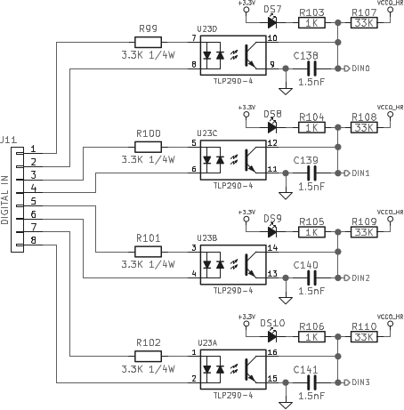
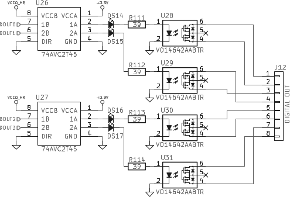

# CIAA ACC Hardware User guide

## Overview

* FPGA+SoC Zynq-7000 XC7Z030-2FBG676I
  [[ds190](https://www.xilinx.com/support/documentation/data_sheets/ds190-Zynq-7000-Overview.pdf)]
* 2 x AS4C256M16D3A-12BIN Alliance DDR3 - 1 GB (32 data bits)
* Quad SPI FLASH S25FL128SAGNFI011 (128 MB, 133MHz)
* SD/SDIO
* Power
* FAN
* Clock
* Status LEDs
* [Boot Selector](#boot-selection)
* User I/Os
  * 2 x [User LEDs](#user-leds)
  * 1 x [User Push Button](#user-push-button) (SRST)
  * 4 x [Digital inputs](#digital-inputs) (isolated)
  * 4 x [Digital outputs](#digital-outputs) (isolated)
  * CAN
  * RS-485
  * Expansion Header
  * EMIO UART
* GigaBit Ethernet
* USB OTG
* HDMI
* PCIe/104
* 1 x [VITA 57.1 FMC-HPC Connector](#fmc-hpc-connector)
* JTAG/Debug
* JTAG Header

## Resources

* [GitHub Repositorie](https://github.com/ciaa/Hardware/tree/master/PCB/ACC/CIAA_ACC)
* [Schematic](https://github.com/ciaa/Hardware/tree/master/PCB/ACC/CIAA_ACC/output_files/ciaa_acc_sch_v1.1.pdf)

## Description

## Boot selection

The configuration source is controlled by a 2-position DIP switch at J7.

| Config. Source | J7.1 | J7.2 |
|----------------|------|------|
| JTAG           | OFF  | OFF  |
| QSPI           | OFF  | ON   |
| N/A            | ON   | OFF  |
| SD CARD        | ON   | ON   |

### User I/Os

#### User LEDs

There are two user LEDs connected to the BANK 12 (VADJ) of the PL.

| FPGA pin | LED  | Reference |
|----------|------|-----------|
| W14      | DS12 | LED_OK    |
| W17      | DS13 | LED_ERR   |

#### User Push Button

The active low push button SW3 is connected to the PS (SRST).

#### Digital inputs

4 Isolated Digital Inputs are available at J11, connected to the BANK 13 (VADJ) of the PL.
It supports 12 to 24V inputs.

| FPGA pin | Reference | Associated LED |
|----------|-----------|----------------|
| AD24     | DIN0      | DS7            |
| AF25     | DIN1      | DS8            |
| AD23     | DIN2      | DS9            |
| AF24     | DIN3      | DS10           |

#### Digital outputs

4 Isolated Digital Outputs are available at J12, connected to the BANK 13 (VADJ) of the PL.

| FPGA pin | Reference | Associated LED |
|----------|-----------|----------------|
| AD26     | DOUT0     | DS14           |
| AE26     | DOUT1     | DS15           |
| AD25     | DOUT2     | DS16           |
| AE25     | DOUT3     | DS17           |

### FMC HPC connector

The CIAA-ACC board supports the VITA 57.1 FPGA Mezzanine Card (FMC) specification by providing subset implementations of the high pin count (HPC) connector at J5.

The connections between the HPC connector at J5 and AP SoC U1 implements:
* 160 single-ended or 80 differential user-defined signals
* 3 GTX transceivers and 1 GTX clock
* 4 differential clocks
* 1 Present signal (module to the carrier)
* 159 ground and 9 power connections
  * 3.3v: 3A
  * VADJ: 2A
  * 12V: Not implemented
  * VIO_B_M2C: Not implemented
  * VADJ powers the LA banks (BANK_12 and BANK_13)
  * HA and HB banks (BANK_33 and BANK_34), are powered with 1.5/1.8V, selectable by switch J19

#### User Defined Pins

| VITA 57.1 name | FMC pin | FPGA pin | VITA 57.1 name | FMC pin | FPGA pin | VITA 57.1 name | FMC pin | FPGA pin |
|----------------|---------|----------|----------------|---------|----------|----------------|---------|----------|
| LA00_P         | E6      | AC12     | HA00_P         | F4      | D6       | HB00_P         | K25     | F8       |
| LA00_N         | E7      | AD11     | HA00_P         | F5      | C6       | HB00_P         | K26     | E7       |
| LA01_P         | D8      | AC13     | HA01_P         | E2      | C8       | HB01_P         | J24     | F5       |
| LA01_N         | D9      | AD13     | HA01_P         | E3      | C7       | HB01_P         | J25     | E5       |
| LA02_P         | H7      | Y10      | HA02_P         | K7      | G2       | HB02_P         | F22     | D1       |
| LA02_N         | H8      | AA10     | HA02_P         | K8      | F2       | HB02_P         | F23     | C1       |
| LA03_P         | G9      | AB11     | HA03_P         | J6      | G4       | HB03_P         | E21     | C2       |
| LA03_N         | G10     | AB10     | HA03_P         | J7      | F4       | HB03_P         | E22     | B1       |
| LA04_P         | H10     | Y12      | HA04_P         | F7      | E2       | HB04_P         | F25     | G6       |
| LA04_N         | H11     | Y11      | HA04_P         | F8      | E1       | HB04_P         | F26     | G5       |
| LA05_P         | D11     | AE11     | HA05_P         | E6      | J11      | HB05_P         | E24     | F3       |
| LA05_N         | D12     | AF10     | HA05_P         | E7      | H11      | HB05_P         | E25     | E3       |
| LA06_P         | C10     | AE10     | HA06_P         | K10     | D9       | HB06_P         | K28     | J4       |
| LA06_N         | C11     | AD10     | HA06_P         | K11     | D8       | HB06_P         | K29     | J3       |
| LA07_P         | H13     | W13      | HA07_P         | J9      | J8       | HB07_P         | J27     | H7       |
| LA07_N         | H14     | Y13      | HA07_P         | J10     | H8       | HB07_P         | J28     | H6       |
| LA08_P         | G12     | AA13     | HA08_P         | F10     | C9       | HB08_P         | F28     | H2       |
| LA08_N         | G13     | AA12     | HA08_P         | F11     | B9       | HB08_P         | F29     | G1       |
| LA09_P         | D14     | AB12     | HA09_P         | E9      | B10      | HB09_P         | E27     | H4       |
| LA09_N         | D15     | AC11     | HA09_P         | E10     | A10      | HB09_P         | E28     | H3       |
| LA10_P         | C14     | AA15     | HA10_P         | K13     | B7       | HB10_P         | K31     | M7       |
| LA10_N         | C15     | AA14     | HA10_P         | K14     | A7       | HB10_P         | K32     | L7       |
| LA11_P         | H16     | Y17      | HA11_P         | J12     | F9       | HB11_P         | J30     | K6       |
| LA11_N         | H17     | AA17     | HA11_P         | J13     | E8       | HB11_P         | J31     | J6       |
| LA12_P         | G15     | W16      | HA12_P         | F13     | A9       | HB12_P         | F31     | K2       |
| LA12_N         | G16     | W15      | HA12_P         | F14     | A8       | HB12_P         | F32     | K1       |
| LA13_P         | D17     | AE12     | HA13_P         | E12     | J10      | HB13_P         | E30     | J1       |
| LA13_N         | D18     | AF12     | HA13_P         | E13     | J9       | HB13_P         | E31     | H1       |
| LA14_P         | C18     | AE13     | HA14_P         | J15     | B6       | HB14_P         | K34     | N3       |
| LA14_N         | C19     | AF13     | HA14_P         | J16     | A5       | HB14_P         | K35     | N2       |
| LA15_P         | H19     | W18      | HA15_P         | F16     | M8       | HB15_P         | J33     | M2       |
| LA15_N         | H20     | W19      | HA15_P         | F17     | L8       | HB15_P         | J32     | L2       |
| LA16_P         | G18     | Y18      | HA16_P         | E15     | K8       | HB16_P         | F34     | K5       |
| LA16_N         | G19     | AA18     | HA16_P         | E16     | K7       | HB16_P         | F35     | J5       |
| LA17_P         | D20     | AD20     | HA17_P         | K16     | L5       | HB17_P         | K37     | M6       |
| LA17_N         | D21     | AD21     | HA17_P         | K17     | L4       | HB17_P         | K38     | M5       |
| LA18_P         | C22     | AC23     | HA18_P         | J18     | B5       | HB18_P         | J36     | N4       |
| LA18_N         | C23     | AC24     | HA18_P         | J19     | B4       | HB18_P         | J37     | M4       |
| LA19_P         | H22     | Y16      | HA19_P         | F19     | A4       | HB19_P         | E33     | L3       |
| LA19_N         | H23     | Y15      | HA19_P         | F20     | A3       | HB19_P         | E34     | K3       |
| LA20_P         | G21     | AF15     | HA20_P         | E18     | B2       | HB20_P         | F37     | N7       |
| LA20_N         | G22     | AF14     | HA20_P         | E19     | A2       | HB20_P         | F38     | N6       |
| LA21_P         | H25     | AE20     | HA21_P         | K19     | C4       | HB21_P         | E36     | N1       |
| LA21_N         | H26     | AE21     | HA21_P         | K20     | C3       | HB21_P         | E37     | M1       |
| LA22_P         | G24     | W20      | HA22_P         | J21     | D4       |
| LA22_N         | G25     | Y20      | HA22_P         | J22     | D3       |
| LA23_P         | D23     | AB17     | HA23_P         | K22     | E6       |
| LA23_N         | D24     | AB16     | HA23_P         | K23     | E5       |
| LA24_P         | H28     | AA19     |
| LA24_N         | H29     | AB19     |
| LA25_P         | G27     | AC17     |
| LA25_N         | G28     | AC16     |
| LA26_P         | D26     | AC21     |
| LA26_N         | D27     | AC22     |
| LA27_P         | C26     | AE18     |
| LA27_N         | C27     | AF18     |
| LA28_P         | H31     | AE16     |
| LA28_N         | H32     | AE15     |
| LA29_P         | G30     | AA20     |
| LA29_N         | G31     | AB20     |
| LA30_P         | H34     | AD16     |
| LA30_N         | H35     | AD15     |
| LA31_P         | G33     | AD18     |
| LA31_N         | G34     | AD19     |
| LA32_P         | H37     | AC18     |
| LA32_N         | H38     | AC19     |
| LA33_P         | G36     | AE17     |
| LA33_N         | G37     | AF17     |

#### Differential Reference Clocks

| VITA 57.1 name | FMC pin | FPGA pin |
|----------------|---------|----------|
| CLK0_M2C_P     | H4      | AB15     |
| CLK0_M2C_N     | H5      | AB14     |
| CLK1_M2C_P     | G2      | AC14     |
| CLK1_M2C_N     | G3      | AD14     |
| CLK2_M2C_P     | K4      | J14      |
| CLK2_M2C_N     | K5      | H14      |
| CLK3_M2C_P     | J2      | D15      |
| CLK3_M2C_N     | J3      | D14      |

#### Gigabit Interface

| VITA 57.1 name | FMC pin | FPGA pin |
|----------------|---------|----------|
| GBTCLK0_M2C_P  | D4      | R6       |
| GBTCLK0_M2C_N  | D5      | R5       |
| DP0_M2C_P      | C6      | Y4       |
| DP0_M2C_N      | C7      | Y3       |
| DP0_C2M_P      | C2      | W2       |
| DP0_C2M_N      | C3      | W3       |
| DP1_M2C_P      | A2      | V4       |
| DP1_M2C_N      | A3      | V3       |
| DP1_C2M_P      | A22     | U2       |
| DP1_C2M_N      | A23     | U1       |
| DP2_M2C_P      | A6      | T4       |
| DP2_M2C_N      | A7      | T3       |
| DP2_C2M_P      | A22     | U2       |
| DP2_C2M_N      | A23     | U1       |

#### Misc

| VITA 57.1 name | FMC pin | FPGA pin |
|----------------|---------|----------|
| PRSNT_M2C_L    | H2      | AF19     |
